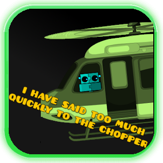

# EasyDialog
This is where she makes a mod.


for help go [here](https://github.com/FigmentBoy/DialogHandler)

here is a example one
```json

{
    "color": 2,
    "lines": [
        {
            "portrait": 12,
            "title": "Rick",
            "message": "We're no strangers to love, {user}!"
        },
        {
            "portrait": 13,
            "title": "Rick",
            "message": "You know the rules, and so do I!"
        }
    ]
}

```
